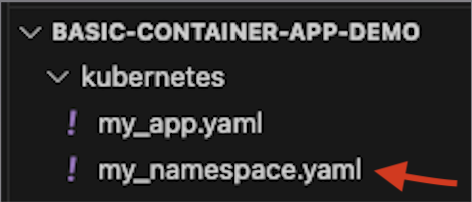

# Basic-Container-App-Demo
Let's deploy to Kubernetes!   

## Git Clone
On Mac or Linux, open application "terminal" or "iTerm"   
run command `git clone https://github.com/njk187/Basic-Container-App-Demo.git`   
run command `cd Basic-Container-App-Demo`   

On Windows, open application "PowerShell"   
run command `git clone https://github.com/njk187/Basic-Container-App-Demo.git`   
run command `cd Basic-Container-App-Demo`   

## Login to Rancher and Obtain KubeConfig
1. Navigate to the URL provided by your instructor and then click "Log in with AzureAD"

2. Click on K8s cluster "np-shared-oke"

3. At the top right of the screen, click "Download KubeConfig"

4. You should have a file in your Downloads folder called "np-shared-oke.yaml". This file gives you access to the Kubernetes cluster.

## Set Kubectl Context
On Mac or Linux   
run command `export KUBECONFIG=~/Downloads/np-shared-oke.yaml`   

On Windows   
run command `$env:KUBECONFIG = "$env:USERPROFILE\Downloads\np-shared-oke.yaml"`   

## Configure YAML Files for Deployment
1. Open file `./kubernetes/my_namespace.yaml`   
   
    - Replace `<USER_ID>` on line 4 with your company 6 character user ID
2. Open file `./kubernetes/my_app.yaml`   
    - Replace `<USER_ID>` on line 5 with your company 6 character user ID
    - Replace `<REGISTRY>` on line 17 with the value your instructor will provide
    - Replace `<USER_ID>` on line 35 with your company 6 character user ID
    - Replace `<USER_ID>` on line 38 with your company 6 character user ID
    - Replace `<USER_ID>` on line 41 with your company 6 character user ID
    - Replace `<USER_ID>` on line 53 with your company 6 character user ID
    - Replace `<USER_ID>` on line 60 with your company 6 character user ID

## Deploy!
On Mac or Linux   
run command `kubectl create -f ./kubernetes/my_namespace.yaml && kubectl apply -f ./kubernetes/my_app.yaml`   

On Windows   
run command

## See App
In your web browser, navigate to `<USER_ID>.np-shared.shw-oke.com`   

## Deploy App Version 2
Our product owner thinks that the app is too boring. Let's deploy Version 2 of the app!   
1. Open file `./kubernetes/my_app.yaml`   
    - Replace `v1` on line 17 with `v2`
2. Run the deployment command again (see above)   

3. We even have a working Nav Bar! Wow... we are Fancy.   

